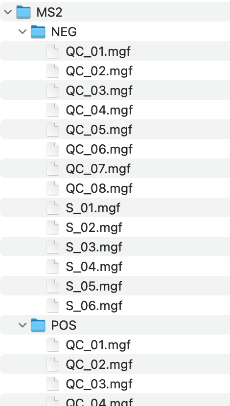
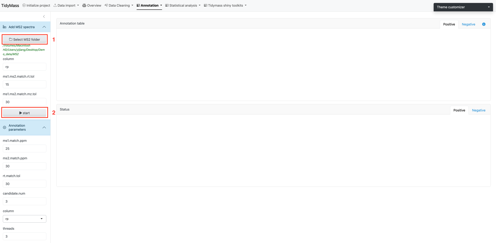
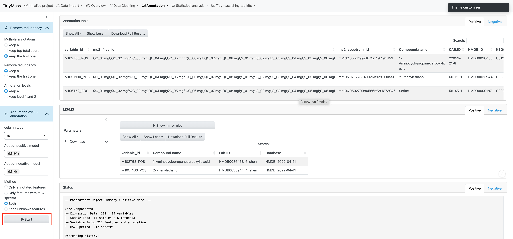
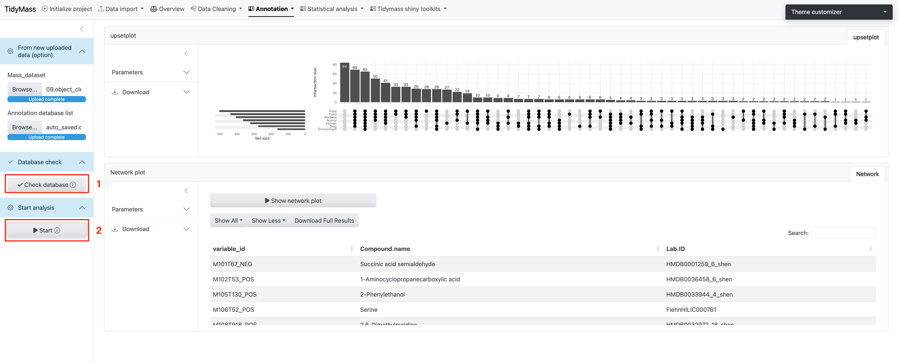
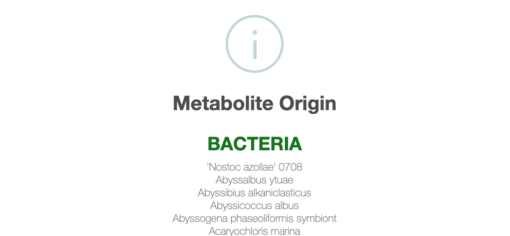
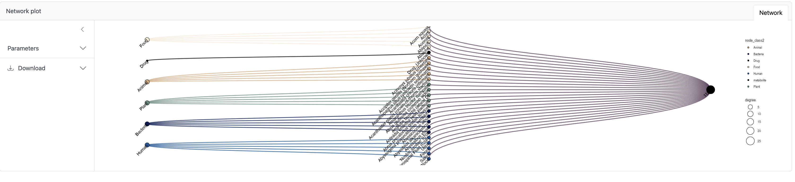
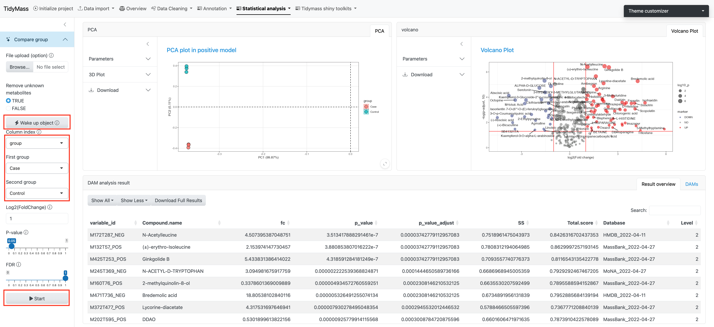
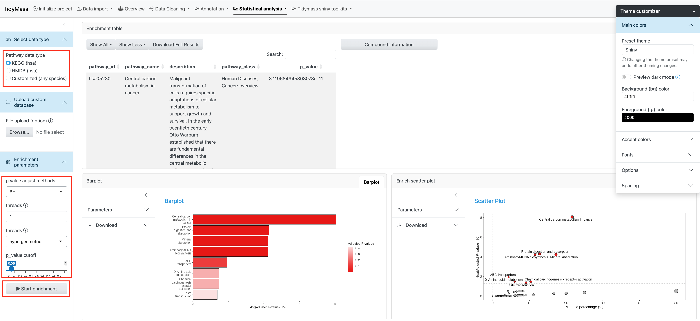

# Downstream data processing

## Metabolite annotation

Metabolite annotation can be performed based on in-house and available open-source databases. To begin with, you need to click **Select MS2 folder** and import prepared MS2 data. These files should be in the format of ".mgf", and they should be stored separately for negative and positive modes.

**Parameters**

* column: A character vector specifying the column types. Default is "rp".
* ms1.ms2.match.mz.tol: Numeric, the m/z tolerance for matching MS1 and MS2. Default is 15.
* ms1.ms2.match.rt.tol: Numeric, the retention time tolerance for matching MS1 and MS2. Default is 30.

Once you have set the parameters, click **Start** to import MS2 data.

Next, you can choose suitable parameters for metabolite annotation.

**Parameters**

* ms1.match.ppm: A numeric value specifying the mass accuracy threshold for MS1 matching in parts per million (ppm). Defaults to 25.
* ms2.match.ppm: A numeric value specifying the mass accuracy threshold for MS2 (Fragment ion) matching in ppm. Defaults to 30.
* rt.match.tol: A numeric value specifying the retention time matching tolerance in seconds. Defaults to 30.
* candidate.num: A numeric value specifying the number of top candidates to retain per feature. Defaults to 3.
* column: A character string specifying the chromatographic column type, either "rp" (reverse phase) or "hilic". Defaults to "rp".
* threads: An integer specifying the number of threads to use for parallel processing. Defaults to 3.

We need necessary MS2 databases for metabolite annotation, and here we provide some common in-house databases such as Mona, Massbank and HMDB. 

More MS2 compound databases can be downloaded from [Tidymass Website](https://www.tidymass.org/databases/){target="_blank"}. After the download is complete, place them in a new folder and click **Choose folder**.

Click **Start annotation** to begin the job (The job will start about 10s after you click the button, don't click again!).

## Annotation filtering

The annotation results are assigned confidence levels according to MSI (in-house database, level 1; public MS2 database, level 2; MS1 database, level 3).

After obtaining annotation results, you can choose how to keep multiple annotations, how to remove redundancy and how to keep annotation levels.

Click **Adduct for level 3 annotation** and select suitable models and methods, then click **START** to perform annotation filtering.

## Metabolites origin

The metabolites origin module can help us determine the origin of annotated metabolites.

First, you need to click "Check database" and then you can click "Start" to perform the analysis. 

You will see the Upset plot on the right, which demonstrates the overall distribution of origins and their intersection for all the compounds.

If you are interested in the origin of a compounds you can select it and click **Show network plot**. 

Here you can also see the visualized result (need to scroll down).

## Differential Accumulated Metabolites (DAM)

To begin with, click **Wake up object** to wake up the massdataset object.

You need to select the sample attribute and here we use group as an example. Then set the second group as Control and click Start. The corresponding PCA plot and Volcano plot will be illustrated on the right. You can set parameters like **Log2(FoldChange)**, **P-value** (cutoff based on p-value) and **FDR** (cutoff based on Adjusted p-value).

## Enrichment
Two types of pathway data are provided: KEGG pathway and HMDB pathway. You may also choose to upload the custom database by clicking Upload custom database.

Here you can set the p value adjust methods and p-value cutoff. You may also change the threads to accelerate the job.

**Barplot** and **Enrich scatter plot** are provided to show the pathway enrichment.

