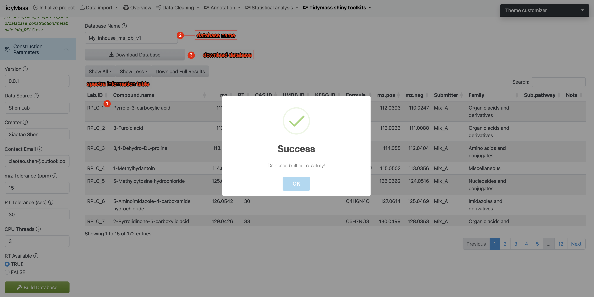
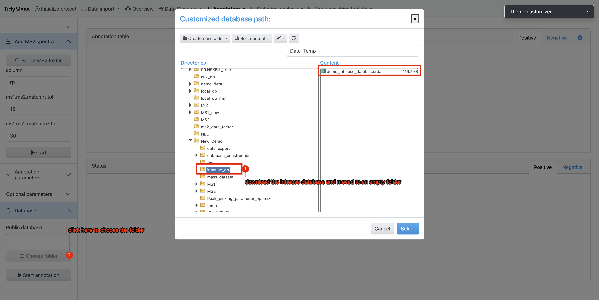
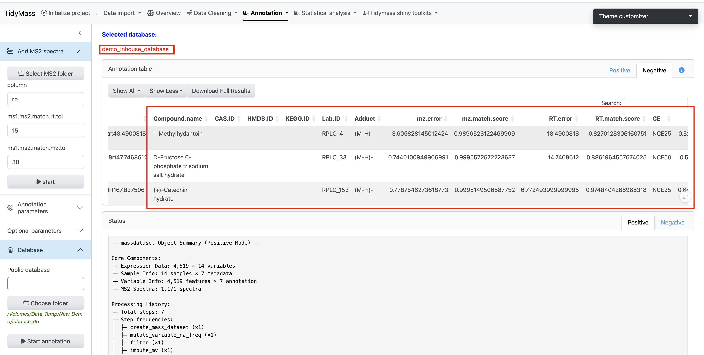

# Tidymass shiny Toolkits

## Feature-based Pathway Analysis (FPA)

The metabolic feature-based functional module analysis approach can significantly expands biological interpretation beyond MS2 spectra-based annotated metabolites. You may refer to [Tidymass Website](https://www.tidymass.org/docs/){target="_blank"} for detailed documentation.

## Metabolite database construction

If you have in-house standards which have been acquired with MS2 spectra data, then you can construct the in-house MS2 spectra databases using the [MetID](https://metid.tidymass.org/){target="_blank"} package.

There are no specific requirements on how to run the LC/MS data for users. As the in-house database construction in metid is used for users to get the in-house databases for themselves (including m/z, retention time and MS/MS spectra of metabolites, for level 1 annotation (Sumner et al., 2007)), so the users just need to run the standards using the same column, LC-gradient, and MS settings with their real samples in the lab

**Data preparation**

In Tidymass shinyapp, we provide a dedicated module for in-house database construction. To prepare your workflow, please follow the comprehensive step-by-step instructions available at:  
[https://metid.tidymass.org/articles/database_construction](https://metid.tidymass.org/articles/database_construction){target="_blank"}

**Construct in-house database with MS2 spectra**

1. **Selec input file**
	- Click the File Path button
	- Select a CSV-formatted file containing metabolite metadata.
	

2. **Configure Database Parameters**
	- Navigate to the **Construction Parameters** tab
	- Review and adjust database-specific details 
	- Click the **Build Database** button to initiate the process 
	

3. **Result Verification & Database Export**
	- Spectral information will be displayed in the main interface (verify key metadata like m/z values and retention times)
	- Assign a unique identifier to your custom database (eg: "demo_inhouse_database")
	- Click **Download Database** to save the compiled database to your local system
	

  
4. **Workflow Execution:**
	- Place the downloaded database file (.rda, R Data format) into a dedicated empty directory
	- During the **Metabolite Annotation** phase of the workflow:  
	    ‣ Click **Choose Folder**  
	    ‣ Navigate to the directory containing your custom database
	- Initiate the annotation process by clicking the **Start Annotation** button

