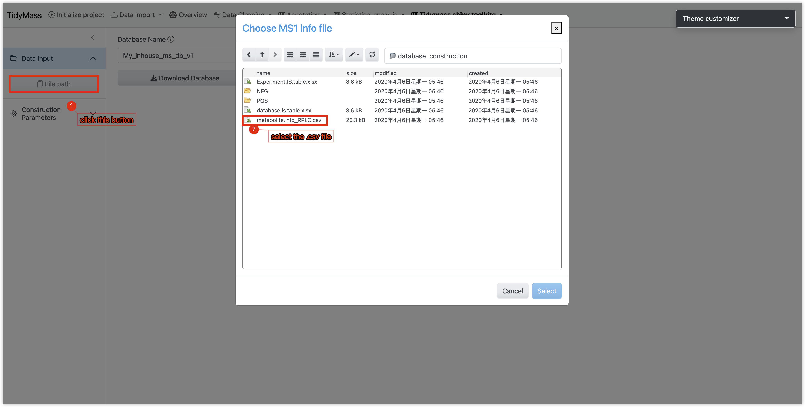
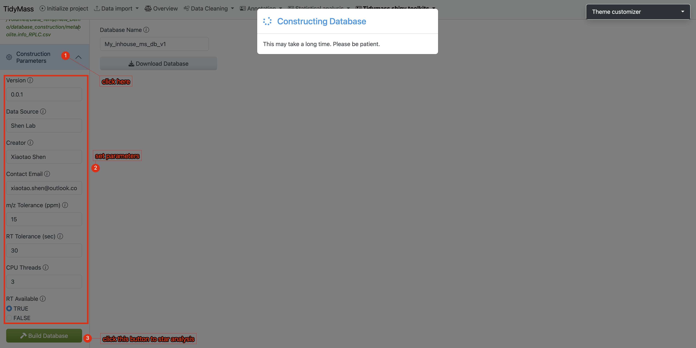
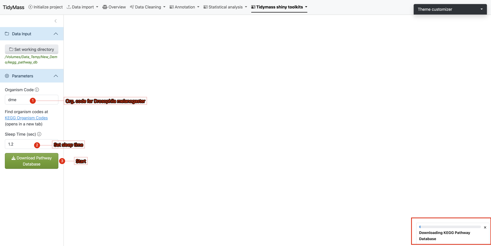
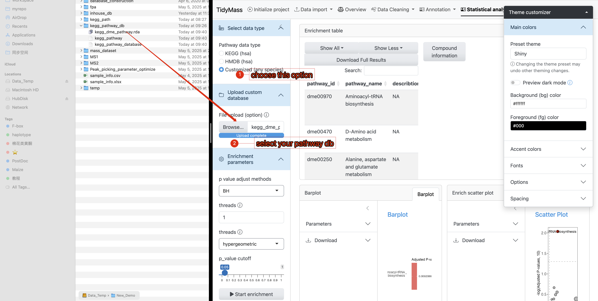
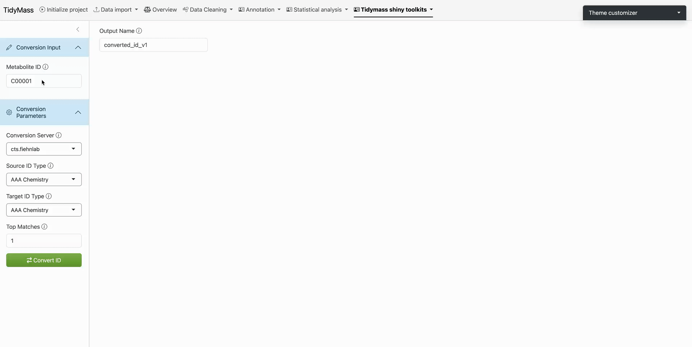

# Tidymass shiny Toolkits

## Feature-based Pathway Analysis (FPA)

The metabolic feature-based functional module analysis approach can significantly expands biological interpretation beyond MS2 spectra-based annotated metabolites. You may refer to [Tidymass Website](https://www.tidymass.org/docs/){target="_blank"} for detailed documentation.

## Metabolite database construction

If you have in-house standards which have been acquired with MS2 spectra data, then you can construct the in-house MS2 spectra databases using the [MetID](https://metid.tidymass.org/){target="_blank"} package.

There are no specific requirements on how to run the LC/MS data for users. As the in-house database construction in metid is used for users to get the in-house databases for themselves (including m/z, retention time and MS/MS spectra of metabolites, for level 1 annotation (Sumner et al., 2007)), so the users just need to run the standards using the same column, LC-gradient, and MS settings with their real samples in the lab

**Data preparation**

In Tidymass shinyapp, we provide a dedicated module for in-house database construction. To prepare your workflow, please follow the comprehensive step-by-step instructions available at:  
[https://metid.tidymass.org/articles/database_construction](https://metid.tidymass.org/articles/database_construction){target="_blank"}

**Construct in-house database with MS2 spectra**

1. **Selec input file**
	- Click the File Path button
	- Select a CSV-formatted file containing metabolite metadata.
	

2. **Configure Database Parameters**
	- Navigate to the **Construction Parameters** tab
	- Review and adjust database-specific details 
	- Click the **Build Database** button to initiate the process 
	

3. **Result Verification & Database Export**
	- Spectral information will be displayed in the main interface (verify key metadata like m/z values and retention times)
	- Assign a unique identifier to your custom database (eg: "demo_inhouse_database")
	- Click **Download Database** to save the compiled database to your local system
	

  
4. **Workflow Execution:**
	- Place the downloaded database file (.rda, R Data format) into a dedicated empty directory
	- During the **Metabolite Annotation** phase of the workflow:  
	    ‣ Click **Choose Folder**  
	    ‣ Navigate to the directory containing your custom database
	- Initiate the annotation process by clicking the **Start Annotation** button

## KEGG Pathway Database Construction

When the research subject is not human, constructing a species-specific KEGG pathway database becomes essential for conducting enrichment analysis. The KEGG database contains comprehensive metabolic pathway data for various organisms, including 1,169 eukaryotes, 9,208 bacteria, and 449 archaea (refer to [KEGG Organisms List](https://www.genome.jp/kegg/tables/br08606.html){target="_blank"}). Researchers should first identify their target species' organism code (e.g., `hsa` for *Homo sapiens*, `mmu` for *Mus musculus*, `ath` for *Arabidopsis thaliana*) from this resource.

The tidymass shiny provides a dedicated module for constructing species-specific pathway databases using these organism codes. The generated pathway database can subsequently be applied to metabolite KEGG pathway enrichment analysis through either the tidymass shiny interface or tidymass R programming.

**Operational Workflow**

1. **Directory Preparation**

   Create a dedicated working directory (e.g., `kegg_pathway_db`). Navigate to the `KEGG Pathway Database Construction` tool under the `Tidymass Shiny Toolkits` dropdown menu in the tidymass shiny interface.

2. **Workspace Configuration**

   - Click `Set working directory` in the sidebar's *Data Input* section
   - Select the newly created `kegg_pathway_db` directory

3. **Parameter Settings**

   Under the *Parameters* section:
   - Enter the target organism code (case-sensitive)
   - Set sleep time between 1-1.5 seconds (minimum 1s to prevent server overload)
   - Initiate download by clicking `Download pathway`

4. **Execution Monitoring**

   - A progress bar will appear in the lower-right interface
   - Real-time KEGG pathway data retrieval requires stable internet connectivity
   - If interruptions occur:
     * Verify network connection
     * Consider increasing sleep interval

5. **Completion Verification**

   Upon successful database construction:
   - The main interface displays execution logs
   - File paths of generated databases are explicitly shown

This automated process ensures reproducible creation of organism-specific KEGG pathway resources while maintaining compliance with KEGG server access protocols.

6. **Use your pathway database in KEGG enrichment analysis**

  In the annotation results, you will find that Pathway IDs adopt the organism code (e.g., dme) from your custom database as their prefix. This confirms  that your provided database was successfully utilized during the KEGG enrichment analysis.

## Metabolite ID Conversion

Metabolites often possess distinct identifiers across analytical databases, necessitating cross-platform ID translation. Tidymass Shiny offers integrated solutions for this purpose:

1. **Established Services**

   - [CTS - Chemical Translation Service](https://cts.fiehnlab.ucdavis.edu/){target="_blank"} by Fiehn Lab
   - [ChemSpider](https://www.chemspider.com/){target="_blank"} chemical structure resolver
  
2. **Experimental AI-Powered Conversion**

   - Utilizes OpenAI's language models (*caution: non-finetuned LLMs may generate unreliable outputs; use judiciously*)

**API Requirements**

- ChemSpider: [Register API key](https://developer.rsc.org/getting-started){target="_blank"}
- OpenAI: [Obtain API credentials](https://platform.openai.com/api-keys){target="_blank"}

---

**Operational Protocol**

Step 1: **Platform Selection**

- Under *Convert Parameters*, choose a translation service

Step 2: **Input Configuration**

1. **Source Identification**

   - Enter query term in *Source ID Type* (autocompletion suggests compatible databases)
   - Example: Select *Chemical Name*
   
2. **Target Specification**

   - Choose output format in *Target ID Type* (e.g., HMDB ID)

Step 3: **Execution**

- Input compound identifiers in *Conversion Input*
- Click `Convert ID`

Step 4: **Output Retrieval**

- Translated IDs display in tabular/JSON format after computational latency
- Failed mappings highlight discrepancies for manual verification

