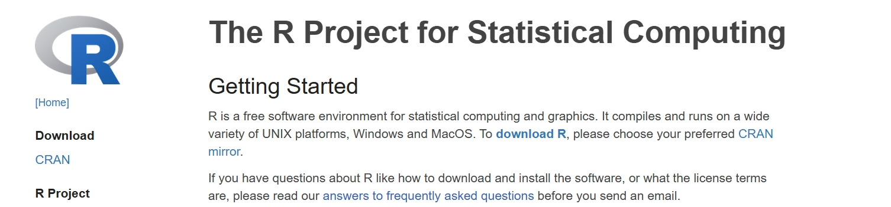

--- 
title: "Tutorials for Tidymass shinyapp"
site: bookdown::bookdown_site
documentclass: book
bibliography:
- book.bib
- packages.bib
description: |
  This is a minimal example of using the bookdown package to write a book.
  set in the _output.yml file.
  The HTML output format for this example is bookdown::gitbook,
link-citations: true
github-repo: "rstudio/bookdown-demo"
---

# Installation and access instructions

[Tidymass shinyapp](https://github.com/tidymass/tidymass_shiny){target="_blank"} is a user-friendly web application for [Tidymass](https://www.tidymass.org/){target="_blank"} that requires little or no programming experience.

We provided online version so that you can simply access it and analyze your data. If you want to process the data locally, we also provide various download options. To be specific, the app can be installed via code, docker and server, and we will introduce how to do that step by step in this chapter.

## Access the online version

To access the online version of Tidymass shinyapp, you can simply click the link: [http://139.224.119.36/tidymass-shiny/](http://139.224.119.36/tidymass-shiny/ ){target="_blank"}


This online version is hosted on a server, and you can use it to analyze your data without any installation. However, please note that the online version may have some limitations in terms of data size and processing speed. For example, the upload file size is restricted to **512MB**.

## Install R and Rstudio

You may choose to use the local version of Tidymass shinyapp, which requires you to install R and Rstudio on your computer. This allows you to analyze larger datasets and have more control over the analysis process.

If you have installed them before, please ensure that R version > 4.1 as tidymass required, ohterwise download and install the [latest version of R](https://cran.r-project.org/mirrors.html){target="_blank"}.

**Install R**

Download [R](https://www.r-project.org/){target="_blank"} and install it. 



**Install Rstudio**

Download [Rstudio](https://posit.co/download/rstudio-desktop/#download){target="_blank"} and install it.


**Open the Rstudio**


## (For Mac User) Install Cario

Cairo is a 2D graphics library used by R for high-quality plots and needed for Tidymass Shinyapp. On macOS, it requires the X11 system, which is not installed by default. You can follow the following steps if you haven't install Cairo.

First, visit the official website of [XQuartz](https://www.xquartz.org/){target="_blank"} and install it, and this will restart your computer.


Next, you can install **Cairo** by running the code in Rstudio:

```{r, eval=FALSE}
install.packages("Cairo", type = "source")
```

If the installation is successful, you should be able to library it:

```{r, eval=FALSE}
library(Cairo)
```

## Install Tidymass shinyapp

First, you are recommended to install **Tidymass** with the following code. For more information and guidance, please refer to [Tidymass Website](https://www.tidymass.org/){target="_blank"}

```{r, eval=FALSE}
remotes::install_gitlab("tidymass/tidymass")
```

Second, install the necessary packages:

```{r, eval=FALSE}
if (!require('remotes')) install.packages('remotes');
if (!require('tidyverse')) install.packages('tidyverse');
if (!require('writexl')) install.packages("writexl");
if (!require('hexbin')) install.packages('hexbin')
if (!require('ComplexUpset'))install.packages('ComplexUpset');
if (!require('shinyalert'))install.packages('shinyalert');
if (!require('shinyFiles')) remotes::install_github('thomasp85/shinyFiles');
if (!require('shinyWidgets')) remotes::install_github("dreamRs/shinyWidgets");
if (!require('shiny')) install.packages('shiny');
if (!require('bsicons')) install.packages('bsicons');
if (!require('bslib')) install.packages('bslib');
if (!require('plotly')) install.packages('plotly');
if (!require('colourpicker')) install.packages('colourpicker');
if (!require('massdbbuildin')) remotes::install_github('tidymass/massdbbuildin') 
if (!require('massdatabase')) remotes::install_gitlab("jaspershen/massdatabase")
  
```

Finally, install Tidymass shinyapp with the code:

```{r, eval=FALSE}
remotes::install_github('tidymass/tidymass_shiny')
```


To start the Tidymass shinyapp:

```{r, eval=FALSE}
library(tidyverse)
library(tidymass)
library(tidymassshiny)
run_tidymass_shiny()
```

You should be able to see:


## Install docker version

[Docker](https://www.docker.com/){target="_blank"}, a group of platform as a service (PaaS) products, uses OS-level virtualization to provide software in containers. It's useful for individuals who want to share the code, data, and analysis environment with others to repeat their analysis and results.

We provide a docker version of tidymass shinyapp, all the packages in tidymass shinyapp and the dependent packages have been installed.

**Install docker**

You can refer the the [official website](https://www.docker.com/get-started){target="_blank"} to download the docker. Then run docker.

**Pull the tidymassshiny image**

Open your terminal (on Windows, use Command Prompt, PowerShell, or Windows Terminal) and type the following command:

```{r, eval=FALSE}
docker pull tidymass/tidymassshiny:latest
```

**Get the path of the demo data**

Since the Shiny app utilizes `shinyFiles` to obtain file or folder paths, you need to mount your **working directory** into the Docker image when running the Docker version of `tidymassshiny`. Here are instructions.

For macOS systems,  you can get the path for the demo data from `Get Info`, the path may look like `/Users/yijiang/Desktop/Demo_data`. For Windows OS, the path may look like `C:\Users\Yijiang\Documents`. Here you need to copy **Your Own Path**.


**Ensure Docker Desktop has permission to demo data**

Ensure Docker Desktop has permission to access the drive containing your working directory:

  1. Open **Docker Desktop**.
  2. Go to **Settings > Resources > File Sharing**.
  3. Add the drive or folder (e.g., `/Users/yijiang/Desktop/Demo_data`) to the shared folders list.
  4. Click **Apply & Restart**.


Please make sure the demo file has the required permissions before proceeding to the next steps. Here are some guidance for [Mac](https://support.apple.com/en-sg/guide/mac-help/mchlp1203/mac){target="_blank"} and [Windows](https://answers.microsoft.com/en-us/windows/forum/all/give-permissions-to-files-and-folders-in-windows/78ee562c-a21f-4a32-8691-73aac1415373){target="_blank"}.

Here replace `/Users/yijiang/Desktop/Demo_data` with **your own path** that you just give permission to the Docker Desktop. Then run the code:

```{r, eval=FALSE}
docker run -p 3838:3838 -v /Users/yijiang/Desktop/Demo_data:/home tidymass/tidymassshiny:latest
```

This command achieves two purposes:
- Starts the Docker image.
- Mounts your working directory to the `/home` path within the container.

**Running the Application**

In terminal, a series of R package loading information will be printed. Until you see the prompt below, tidymassshiny has been successfully running：

```{r, eval=FALSE}
R version 4.3.3 (2024-02-29) -- "Angel Food Cake"
...
...
...
## Until this message show up.
Listening on http://0.0.0.0:3838
```

Then open the browser (Google，Firefox，Edge or Safari), paste the address `http://localhost:3838` in the address bar, and the web page can jump to the tidymass shinyapp page. 

Enjoy your metabolomic data analysis process!


## Install server version

To better handle large-scale metabolite data analysis, tidymass_shiny can be deployed on high-performance servers.

This guide walks you through deploying tidymass_shiny  on `Ubuntu 20.04 LTS` server

**Step 1: Install Required System Libraries**

Ensure the system has the necessary libraries for R package compilation and Shiny functionality. These libraries are critical for graphics, networking, and data processing.

-**Update package lists**:

```{r, eval=FALSE}
sudo apt update
```

-**Install the libraries**:

```{r, eval=FALSE}
sudo apt install -y gfortran libcurl4-openssl-dev libssh2-1-dev libgit2-dev libpng-dev libjpeg-dev libtiff-dev libcairo2-dev libharfbuzz-dev libfribidi-dev zlib1g-dev libbz2-dev liblzma-dev libnetcdf-dev libxml2-dev libjson-c-dev libssl-dev libfontconfig1-dev libfreetype6-dev libicu-dev libhdf5-dev
```

**Step 2: Create a Shiny User Account**

To isolate the Shiny application and manage permissions effectively, create a dedicated user.

-**Create the `shiny` user**:

```{r, eval=FALSE}
sudo adduser shiny
```

-**Switch to the `shiny` user**:

```{r, eval=FALSE}
su - shiny
```

**Step 3: Install R**

Install the latest version of R from the CRAN repository.

-**Add the CRAN repository**:
    
```{r, eval=FALSE}
sudo apt-key adv --keyserver keyserver.ubuntu.com --recv-keys E298A3A825C0D65DFD57CBB651716619E084DAB9
sudo add-apt-repository 'deb https://cloud.r-project.org/bin/linux/ubuntu focal-cran40/'
```
    
-**Update and install R**:

```{r, eval=FALSE}
sudo apt update
sudo apt install -y r-base r-base-dev
```
    

**Step 4: Install Shiny Server**

Shiny Server hosts and serves your Shiny application.

-**Install `gdebi` to handle `.deb` files**:

```{r, eval=FALSE}
sudo apt install -y gdebi-core
```    

-**Download and install Shiny Server** (verify the latest version at [Shiny Server's official site](https://posit.co/download/shiny-server/){target="_blank"}):

```{r, eval=FALSE}
wget https://download3.rstudio.org/ubuntu-18.04/x86_64/shiny-server-1.5.17.973-amd64.deb
sudo gdebi shiny-server-1.5.17.973-amd64.deb
```        
    
-**Start and enable Shiny Server**:

```{r, eval=FALSE}
sudo systemctl start shiny-server
sudo systemctl enable shiny-server
```          

**Step 5: Set Up the Shiny Application Directory**

Create a directory to store your Shiny application.

-**Create the directory** :

```{r, eval=FALSE}
sudo mkdir /srv/shiny-server/tidymass_shiny
```              

-**Set ownership to the `shiny` user**:

```{r, eval=FALSE}
sudo chown -R shiny:shiny /srv/shiny-server/tidymass_shiny
```        

**Step 6: Install Required R Packages**

Install the R packages needed for your Shiny application.

-**Start R**:

```{r, eval=FALSE}
R
```            
    
**For Chinese users**:

-**Set package mirrors** (optional, for faster downloads):

```{r, eval=FALSE}
options(repos = c(CRAN = 'https://mirrors.tuna.tsinghua.edu.cn/CRAN/'))
options(BioC_mirror = 'https://mirrors.westlake.edu.cn/bioconductor')
```         

-**Install essential packages** 

```{r, eval=FALSE}
install.packages(c('tidyverse', 'writexl', 'hexbin', 'ComplexUpset', 'shinyalert', 'shiny', 'bsicons', 'bslib', 'plotly', 'colourpicker','BiocManager'，'devtools')
BiocManager::install(c('preprocessCore','impute','mzR','MSnbase','Rdisop','BiocGenerics','KEGGREST','DelayedArray','S4Arrays','GenomicRanges','multtest','MassSpecWavelet','xcms','Biobase','AnnotationFilter'))

devtools::install_gitlab('tidymass/masstools') devtools::install_gitlab('tidymass/massqc') devtools::install_gitlab('tidymass/massdataset') devtools::install_gitlab('tidymass/metid') devtools::install_gitlab('tidymass/metpath') devtools::install_gitlab('tidymass/massstat') devtools::install_gitlab('tidymass/massprocesser') devtools::install_gitlab('tidymass/massdatabase') devtools::install_gitlab('tidymass/tidymass') devtools::install_github('thomasp85/shinyFiles') devtools::install_github('dreamRs/shinyWidgets') devtools::install_github('tidymass/massdbbuildin') devtools::install_github('tidymass/tidymass_shiny')
```  


**Step 7: Deploy the Shiny Application**

Add your Shiny app code to the directory.

-**Create `app.R`**:

```{r, eval=FALSE}
sudo nano /srv/shiny-server/my_shiny_app/app.R
```           

-**Add your app code** (example):

```{r, eval=FALSE}
library(tidyverse)
library(tidymass)
library(tidymassshiny)
run_tidymass_shiny()
```      

-**Save and exit** (`Ctrl + O`, `Enter`, `Ctrl + X` in nano).

**Step 8: Restart Shiny Server and Test**

Restart the server and verify your application works.

-**Restart Shiny Server**:

```{r, eval=FALSE}
sudo systemctl restart shiny-server
```          

-**Test the app**:  

Open a browser and go to `http://your-server-ip:3838/tidymass_shiny`.


**Notice**

It is important to note that `tidymass_shiny` utilizes the `shinyFiles` package, which is inherently a local file management system. Theoretically, `shinyFiles` cannot directly access local files. You need to set the raw data directory and raw data under **"/home/shiny"**.


